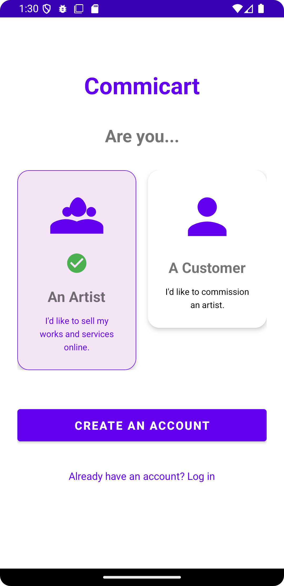
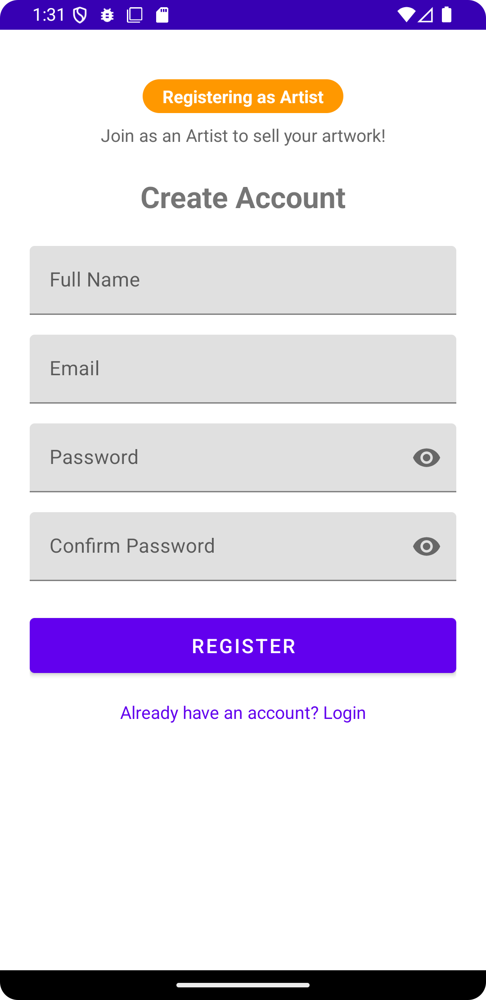
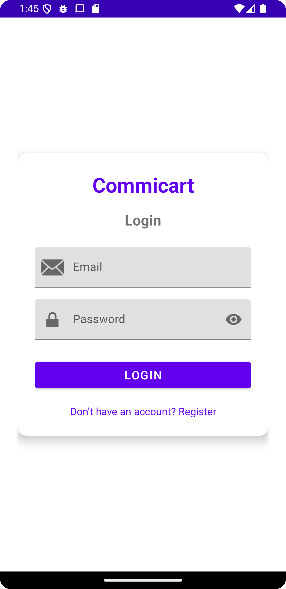
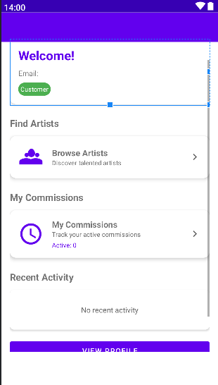
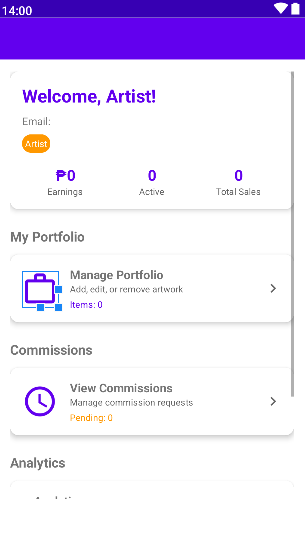
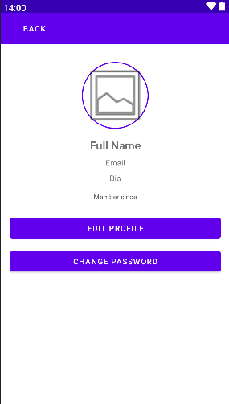
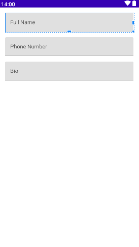

# 🎨 Commicart Android Application

[](https://kotlinlang.org)
[](https://developer.android.com)
[](LICENSE)
[](https://github.com/ichi338/IT342-Commicart-Android)

> A modern Android application connecting artists with customers through art commissions. Built with Kotlin and Material Design.

---

## 📱 Overview

Commicart is a comprehensive Android platform that bridges the gap between talented artists and art enthusiasts. Artists can showcase their portfolios and manage commissions, while customers can discover artists and commission custom artwork. The app features **role-based access control** with dedicated dashboards for both Artists and Customers.

---

## ✨ Key Features

### 🔐 Authentication
| Feature | Description |
|---------|-------------|
| **Role Selection** | Choose between Artist or Customer during registration |
| **User Registration** | Create new account with email, password, and role |
| **User Login** | Secure authentication with JWT tokens |
| **Session Management** | Token-based authentication with SharedPreferences |

### 👤 Profile Management
| Feature | Description |
|---------|-------------|
| **View Profile** | Display user information including role badge |
| **Edit Profile** | Update full name, bio, and phone number |
| **Change Password** | Secure password update functionality |
| **Profile Picture** | Upload and update profile image |

### 🎨 Role-Based Dashboards

#### 🛍️ Customer Dashboard
- Browse artists and artwork
- View active commissions
- Track commission history
- Discover new artists

#### 🎭 Artist Dashboard
- Manage portfolio
- View commission requests
- Track earnings and sales
- View analytics and performance metrics

---

## 🛠️ Tech Stack

### Android Technologies
| Technology | Version | Purpose |
|------------|---------|---------|
| **Kotlin** | 1.9.0 | Primary programming language |
| **Android SDK** | 34 | Android development framework |
| **ViewBinding** | - | Type-safe view access |
| **Retrofit** | 2.9.0 | HTTP client for API calls |
| **Gson** | 2.10.1 | JSON parsing |
| **Glide** | 4.16.0 | Image loading and caching |
| **Coroutines** | 1.7.3 | Asynchronous programming |
| **Material Design** | 1.11.0 | UI components |

### Backend Integration
- **Base URL**: `http://10.0.2.2:8080/` (emulator) / `http://192.168.x.x:8080/` (physical device)
- **Authentication**: Bearer Token (JWT)
- **Data Format**: JSON

---

## 📸 Screenshots

| Role Selection | Registration | Login |
|:--------------:|:------------:|:-----:|
|  |  |  |

| Customer Dashboard | Artist Dashboard | Profile |
|:------------------:|:----------------:|:-------:|
|  |  |  |

| Edit Profile | Change Password |
|:------------:|:---------------:|
|  |  |

---

## 📚 API Documentation

### Base URL
```http
# Development (Android Emulator)
http://10.0.2.2:8080/

# Development (Physical Device)
http://192.168.1.100:8080/

# Production
https://your-api-domain.com/

Authentication
Most endpoints require a Bearer Token:
Authorization: Bearer <your_jwt_token>

1. Register User
POST /api/auth/register
Request Body:

json
{
    "email": "user@example.com",
    "password": "password123",
    "fullName": "John Doe",
    "role": "ARTIST"
}
Response (200 OK):

json
{
    "success": true,
    "message": "User registered successfully",
    "data": null
}
Error Responses:

Status	Description
400	Invalid email format or missing fields
409	Email already registered
2. Login User
http
POST /api/auth/login
Request Body:

json
{
    "email": "user@example.com",
    "password": "password123"
}
Response (200 OK):

json
{
    "success": true,
    "message": "Login successful",
    "data": {
        "token": "eyJhbGciOiJIUzI1NiIs...",
        "userId": "550e8400-e29b-41d4-a716-446655440000",
        "email": "user@example.com",
        "fullName": "John Doe",
        "role": "ARTIST"
    }
}
3. Get User Profile
GET /api/users/profile
Authorization: Bearer <token>
Response (200 OK):

json
{
    "success": true,
    "message": "Profile retrieved",
    "data": {
        "id": "550e8400-e29b-41d4-a716-446655440000",
        "email": "user@example.com",
        "fullName": "John Doe",
        "bio": "Digital artist specializing in fantasy art",
        "phone": "+1234567890",
        "profilePictureUrl": "http://server/image.jpg",
        "role": "ARTIST",
        "createdAt": "2024-01-01T10:00:00",
        "updatedAt": "2024-01-15T15:30:00"
    }
}
4. Update User Profile
PUT /api/users/profile
Authorization: Bearer <token>
Content-Type: application/json
Request Body:

json
{
    "fullName": "John Updated",
    "bio": "Updated bio information",
    "phone": "+9876543210"
}
Response (200 OK):

json
{
    "success": true,
    "message": "Profile updated",
    "data": {
        "id": "550e8400-e29b-41d4-a716-446655440000",
        "fullName": "John Updated",
        "bio": "Updated bio information",
        "phone": "+9876543210"
    }
}
5. Change Password
PUT /api/users/change-password
Authorization: Bearer <token>
Request Body:

json
{
    "oldPassword": "currentPassword123",
    "newPassword": "newPassword456"
}
Response (200 OK):

json
{
    "success": true,
    "message": "Password changed successfully",
    "data": null
}
6. Upload Profile Image
POST /api/users/upload-profile-image
Authorization: Bearer <token>
Content-Type: multipart/form-data
Form Data: image (JPEG or PNG file)

Response (200 OK):

json
{
    "success": true,
    "message": "Profile image uploaded",
    "data": {
        "id": "550e8400-e29b-41d4-a716-446655440000",
        "profilePictureUrl": "http://server/image.jpg",
        "profileImageBytes": "..."
    }
}
🚀 Setup Instructions
Prerequisites
Android Studio Hedgehog | 2023.1.1 or later

JDK 11 or later

Android SDK API Level 34

Backend server running (Spring Boot application)

Step-by-Step Setup
1. Clone the Repository
bash
git clone https://github.com/ichi338/IT342-Commicart-Android.git
cd IT342-Commicart-Android
2. Configure Backend URL
Open app/src/main/java/com/commicart/app/data/network/RetrofitClient.kt:
// For Android Emulator
private const val BASE_URL = "http://10.0.2.2:8080/"

// For Physical Device (use your computer's IP)
// private const val BASE_URL = "http://192.168.1.100:8080/"
3. Enable Cleartext Traffic (for Development)
Ensure AndroidManifest.xml has:
<application android:usesCleartextTraffic="true" ... >
4. Open in Android Studio
Launch Android Studio
Select "Open an Existing Project"
Navigate to the cloned repository
Wait for Gradle sync to complete
5. Run the Application
Connect an Android device or start an emulator

Click the Run button (▶️)

Select your device/emulator

6. Start the Backend Server
cd commicart-backend
./mvnw spring-boot:run
📁 Project Structure
app/src/main/java/com/commicart/app/
├── data/
│   ├── models/                 # Data classes
│   │   ├── ApiResponse.kt
│   │   ├── RegisterRequest.kt
│   │   ├── LoginRequest.kt
│   │   ├── LoginResponse.kt
│   │   ├── User.kt
│   │   ├── EditProfileRequest.kt
│   │   └── ChangePasswordRequest.kt
│   ├── network/                # Network layer
│   │   ├── ApiService.kt
│   │   └── RetrofitClient.kt
│   └── repository/             # Repository pattern
│       └── UserRepository.kt
├── ui/                         # UI layer
│   ├── auth/                   # Authentication
│   │   ├── RoleSelectionActivity.kt
│   │   ├── RegisterActivity.kt
│   │   └── LoginActivity.kt
│   ├── customer/               # Customer features
│   │   └── CustomerDashboardActivity.kt
│   ├── artist/                 # Artist features
│   │   └── ArtistDashboardActivity.kt
│   └── profile/                # Profile management
│       └── ProfileActivity.kt
├── utils/                      # Utility classes
│   ├── TokenManager.kt
│   └── NetworkUtils.kt
└── MainActivity.kt             # Entry point

app/src/main/res/
├── layout/                     # XML layouts
│   ├── activity_role_selection.xml
│   ├── activity_register.xml
│   ├── activity_login.xml
│   ├── activity_customer_dashboard.xml
│   ├── activity_artist_dashboard.xml
│   ├── activity_profile.xml
│   ├── dialog_edit_profile.xml
│   └── dialog_change_password.xml
├── drawable/                   # Icons and images
├── values/                     # Colors, strings, themes
└── AndroidManifest.xml         # App manifest
⚠️ Error Handling
The app implements comprehensive error handling for:

Error Type	User Message	Action
No Internet	"No internet connection"	Prompt to check connection
400 Bad Request	"Invalid email format"	Show specific validation error
401 Unauthorized	"Session expired"	Redirect to login
403 Forbidden	"Access denied"	Show permission error
404 Not Found	"Resource not found"	Show user-friendly message
500 Server Error	"Server error"	Try again later
Network Timeout	"Request timeout"	Retry option
JSON Parse Error	"Data format error"	Report issue
Error Handling Example
kotlin
userRepository.login(request, object : UserRepository.AuthCallback {
    override fun onSuccess(data: Any?) {
        // Handle successful login
    }
    
    override fun onError(message: String) {
        Toast.makeText(context, message, Toast.LENGTH_LONG).show()
        
        when {
            message.contains("401") -> redirectToLogin()
            message.contains("network") -> showRetryOption()
            else -> showGeneralError()
        }
    }
})
🔐 Security Features
Feature	Description
JWT Token Authentication	All API calls authenticated with Bearer tokens
Password Encryption	Passwords encrypted using BCrypt (backend)
Secure Token Storage	Tokens stored in Android SharedPreferences with encryption
Session Management	Automatic logout on token expiration
Input Validation	Client-side validation before API calls
📱 Minimum Requirements
Requirement	Minimum
Android Version	Android 7.0 (API level 24) or higher
RAM	2GB
Internet	Required for API calls
Storage	50MB free space
🐛 Troubleshooting
Issue	Solution
App crashes on launch	Clean and rebuild project
Cannot connect to backend	Check BASE_URL in RetrofitClient
Images not loading	Verify internet connection
Login fails	Check backend server is running
R.java errors	Build → Clean Project → Rebuild
ViewBinding errors	Enable viewBinding in build.gradle
Development Tips
Emulator: Use 10.0.2.2 as localhost

Physical Device: Use your computer's IP address (ipconfig or ifconfig)

Debug Mode: Use Logcat to view network requests

Clear Data: Settings → Apps → Commicart → Clear Data

📄 License
This project is licensed under the MIT License - see the LICENSE file for details.

👥 Contributors
Sigrid Allison S. Laputan - Initial work

🙏 Acknowledgments
Material Design Guidelines
Retrofit Documentation
Android Developer Documentation

🔗 Links
Resource	Link
GitHub Repository:	https://github.com/ichi338/IT342-Commicart-Android
Backend Repository:	Coming soon
API Documentation:	Coming soon
